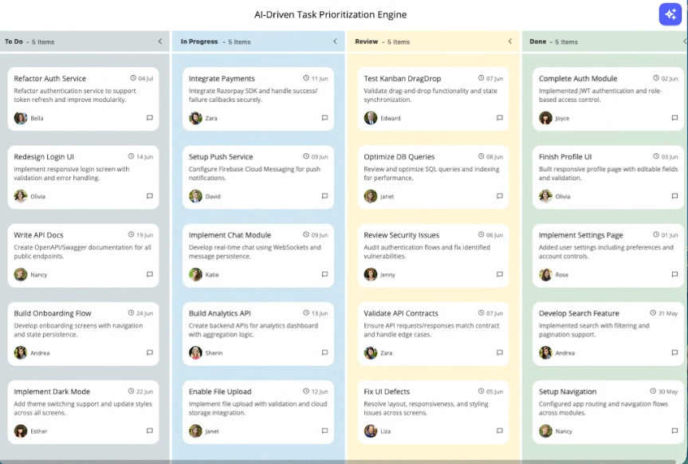

# AI Task Prioritization Engine with MAUI Kanban Board

This sample demonstrates an AI-driven task prioritization engine with a .NET MAUI Kanban Board.

## Sample

```xaml
    <kanban:SfKanban x:Name="kanbanBoard" Grid.Row="1" ItemsSource="{Binding Cards}"
                     ColumnMappingPath="Category" SortingMappingPath="Index"
                     AutoGenerateColumns="False" CardTemplate="{StaticResource CardTemplate}">

        <kanban:SfKanban.Resources>
            <kanban:KanbanPlaceholderStyle x:Key="PlaceholderStyle" Background="#FAC7AD"
                                    SelectionIndicatorBackground="#FAC7AD"
                                    SelectionIndicatorStroke="#914C00">

                <kanban:KanbanPlaceholderStyle.SelectionIndicatorTextStyle>
                    <kanban:KanbanTextStyle TextColor="#914C00" />
                </kanban:KanbanPlaceholderStyle.SelectionIndicatorTextStyle>

            </kanban:KanbanPlaceholderStyle>
        </kanban:SfKanban.Resources>

        <kanban:KanbanColumn Title="To Do" Categories="Open" Background="#DAE0E3"
                        PlaceholderStyle="{StaticResource PlaceholderStyle}" />

        <kanban:KanbanColumn Title="In Progress" Categories="In Progress" Background="#D6EAF5"
                        PlaceholderStyle="{StaticResource PlaceholderStyle}" />

        <kanban:KanbanColumn Title="Review" Categories="Code Review" Background="#FFF8DC"
                        PlaceholderStyle="{StaticResource PlaceholderStyle}" />

        <kanban:KanbanColumn Title="Done" Categories="Done" Background="#DCEDDC" AllowDrag="False"
                        PlaceholderStyle="{StaticResource PlaceholderStyle}" />

    </kanban:SfKanban>
```

## Output




## Requirements to run the demo

To run the demo, refer to [System Requirements for .NET MAUI](https://help.syncfusion.com/maui/system-requirements)

## Troubleshooting:

### Path too long exception

If you are facing path too long exception when building this example project, close Visual Studio and rename the repository to short and build the project.

## License

Syncfusion has no liability for any damage or consequence that may arise from using or viewing the samples. The samples are for demonstrative purposes. If you choose to use or access the samples, you agree to not hold Syncfusion liable, in any form, for any damage related to use, for accessing, or viewing the samples. By accessing, viewing, or seeing the samples, you acknowledge and agree Syncfusion's samples will not allow you seek injunctive relief in any form for any claim related to the sample. If you do not agree to this, do not view, access, utilize, or otherwise do anything with Syncfusion's samples.